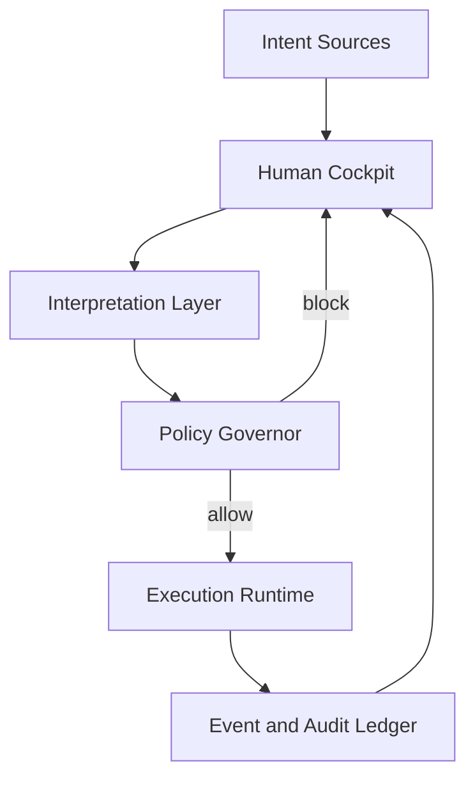

# AEI Technical Architecture (Public)

Date: March 4, 2026

## Scope

This document describes AEI as a governance control plane for AI-assisted operations.

## Canonical Model

`Intent -> Governor -> Execution + Record`

1. Intent layer:
   - Receives action proposals from operators, AI systems, and automation.
2. Governor layer:
   - Applies policy, scope, and safety checks before execution.
3. Execution and record layer:
   - Runs approved actions and writes linked operational records.

## Core Components

1. Human cockpit:
   - Operator-facing control and visibility surface.
2. Interpretation layer:
   - Structures incoming intent into candidate actions.
3. Policy engine:
   - Produces deterministic allow/block decisions.
4. Execution runtime:
   - Runs only policy-approved actions.
5. Event and audit ledger:
   - Captures action intent, decision, execution, and outcome.

## Data Flow

## Governance Invariants

1. No side-effecting action bypasses policy evaluation.
2. Blocked actions include reason and next-step guidance.
3. Executed actions retain correlation-linked records.
4. Evidence export remains available for operational handoff.

## Non-Goals

1. Autonomous self-directed execution loops.
2. Policy bypass by AI agents.
3. Unbounded direct tool execution.

## Forward-Looking Statement

This document contains forward-looking product and architecture statements. Actual implementation details may evolve.
